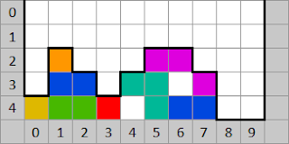
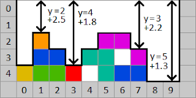
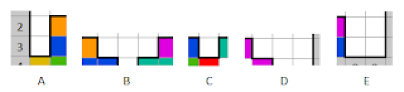
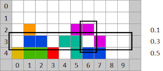
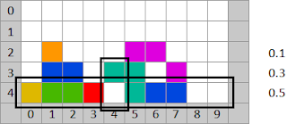

# Tetris Analyzer

A Tetris playing AI, by Joakim Tengstrand.
 
## Table of Contents

- [The Scala version](#the-scala-version)
- [The C++ version](#the-c-version)
- [Optimize the algorithm](#optimize-the-algorithm)
- [How the algorithm works](#how-the-algorithm-works)
  - [Contour height](#contour-height)
  - [The Structure of the Contour](#the-structure-of-the-contour)
  - [Cavities](#cavities)
- [License](#license)

## The Scala version


Watch the computer play!
This highly optimized Tetris playing program can place 76,000 pieces per second on a MacBook Air M4! (set next piece to `off`, and turn on `max speed`).

It clears an average of 3,500,000 rows per game (with sliding turned off) when it doesn't know the next piece on a standard 10x20 board. If it knows the next piece, it has cleared 100,000,000 rows without ever filling more than 50% of the board.

To run the program, clone this repo and go to `langs/scala` and execute:

```bash
./build.sh
./run.sh
```

**Requirements:**
- Java (JDK 8 or later) must be installed. To check if Java is installed, run `java -version`. If not installed:
  - **macOS**: Install via Homebrew: `brew install openjdk` or download from [Adoptium](https://adoptium.net/)
  - **Linux**: Install via package manager, e.g., `sudo apt install default-jdk` (Debian/Ubuntu) or `sudo yum install java-11-openjdk-devel` (RHEL/CentOS)
  - **Windows**: Download from [Adoptium](https://adoptium.net/) or use [Chocolatey](https://chocolatey.org/): `choco install temurin11-jdk`
- If sbt is not installed, the build script will automatically download an sbt launcher. Alternatively, you can install sbt from https://www.scala-sbt.org/download.html

For details on how the algorithm works, see [here](#how-the-algorithm-works).

## The C++ version


Watch the computer play, up to 9 moves ahead!
This version is not as performance-optimized as the Scala version, and can "only" place 26,0000 pieces per second on a MacBook Air M4.

For more instructions, see [here](langs/cpp/README.md)

## Optimize the algorithm


This tool, written in Java, helps you find better parameter values used by the board evaluator, which decides how well it plays (more rows in average per game is better).

To run the program, clone this repo and go to `langs/java` and execute:

```bash
./build.sh
./run.sh example/system.yaml example/five-games-parameter-areaWidthFactor1.yaml
```

This tool is specifically written for the Scala version of the Tetris playing program, but can also be used by versions written in other languages.

For more instructions, see [here](langs/java/README.md)

## How the algorithm works

In the case the next piece is not known, the way the Tetris "AI" program finds the best move is to go through all valid placements of current piece, and for each valid move/placement, any completed/full rows are cleared, after which the position is ready to be evaluated by the algorithm. 

If the next piece is known and/or the search depth (level) is greater than the number of known pieces, the program computes all valid placements for that many moves ahead. For example, it may evaluate current + next, or current + next + all seven possible pieces (in which case it computes the average).
For every level beyond the known pieces, it will prune the tree of variants, so that it only advances to the next level if it finds it necessary. The amount of tree branches ignored increases with each level. This pruning is only supported by the C++ version at the moment.
The position with the lowest evaluation score is considered to be the best move for the current piece. The c++ version allows you to select between the valid moves (affected by sliding on/off)

Assume we have the following position:



The numbers on the left side show the y-values, and the numbers along the bottom show the x-values. As the algorithm currently works, and as it has worked since the C++ version was written sometime between 2001–2002, it evaluates the position based on three properties, which are added together to produce the final score.
The value of the position is referred to in the algorithm as `equity`, a term borrowed from [Backgammon](https://en.wikipedia.org/wiki/Backgammon), where it's used to describe the value of a position. Interestingly, there are quite a few similarities between Backgammon and Tetris, for example, in both games you don’t know which Tetris pieces or Backgammon dice rolls will come next.

The following three properties are measured: contour height, the structure of the contour, and cavities (holes in the structure).

### Contour height

This property measures how tall the construction is — or more precisely, the height of the contour for each column (x-value):



The higher the contour is, the more value is added to the equity. A value of 2.5 is added for columns 1, 5, and 6; 2.2 for columns 2, 4, and 7; 1.8 for columns 0 and 3; and finally 1.3 for columns 8 and 9. In total, this adds up to
2.5×3 + 2.2×3 + 1.8×2 + 1.3×2 = 20.3
added to the equity.

In the newest version of the board evaluator, the constant also varies depending on the x-value, with lower values toward the edges.

This example has a very low height, with a board size of 10×5 compared to the normal 10×20. Had the board been full height, the value would instead have been 0.1×10 = 1, resulting in a much smaller impact on the final equity.

### The Structure of the Contour

The next property that is measured and added to the equity is the number of enclosed areas in the contour. Such an area is separated by “walls” on both sides. When the game begins, this enclosed area is 10×20. The smallest possible enclosed area is 1×1, like C in the image below.

The higher the area is, the more value is added to the equity. The wider the area is, the less value is added to the equity, with the exception of width 3, which has a larger constant than width 2 and is therefore considered worse.



To calculate the value of an area, a constant determined by its width is multiplied by another constant determined by its height.
Area A has width 1, which gives the constant 4.25, and height 2, which gives the constant 1.19, resulting in a product of 5.0575.
Area B has width 3, which gives the constant 3.1, and height 1, which gives the constant 0.42, resulting in a product of 1.302.

There is one additional parameter to consider in this calculation: whether the walls on each side of the area have the same height.
Area B has walls of equal height (y = 2) on both sides (columns 1 and 5), unlike Area D, where the wall heights differ (column 6 has y = 2 and column 10 has y = 0).
Area B is considered slightly more favorable than D:

```
A: 1x2 = 4.25*1.19 = 5.0575
B: 3x1 = 3.1*0.42 = 1.302
C: 1x1 = 4.25*0.42 = 1.785
D: 3x1 = 3.1*0.5 = 1.55
E: 2x2 = 2.39*1.19 = 2.8441
```

Adding these five values together gives `12.5386`, which is added to equity.

### Cavities
This property measures the holes in the position. Holes are defined as rows where there is an empty space that is covered by a row above it. In the image below, row 3 is covered by row 2 in column 6.



The constants on the right-hand side vary depending on the number of filled cells in the row. Three filled cells (row 2) give the constant 0.1, five filled cells (row 3) give the constant 0.3, and seven filled cells (row 4) give the constant 0.5.



For each row starting from the highest contour (y = 2) down to the last row (y = 4), one additional step is performed besides calculating the previously mentioned constant. For each column in the row, the following is done: if a cell is empty, the program checks whether the cell is covered by seeing whether the contour of that column is lower than the row’s y-value, which means a hole has been found.

Then the value to be added to equity is calculated by multiplying all constants from the row corresponding to the contour of the column where the hole was found up to the current row. The value 10 in the calculation is the width of the position:

```
Row 3: (1 − 0.1 * 0.3) * 10 = 9.7
Row 4: (1 − 0.3 * 0.5) * 10 = 8.5
```

Row 3 multiplies with the constants for rows 2 through 3 (2 because column 6 is covered by row 2).
Row 4 multiplies with the constants for rows 3 through 4 (3 because column 4 is covered by row 3).

In total, the “holes” property corresponds to the value 9.7 + 8.5 = 18.2, which is added to the equity.

Equity for each property:
```
Contour height: 20.3
Contour structure: 12.5386
Holes: 18.2
```

This gives a total equity for the position of: `51.0386`

## License

Copyright (c) Joakim Tengstrand. All rights reserved.

The use and distribution terms for this software are covered by the
Eclipse Public License 1.0 (http://opensource.org/licenses/eclipse-1.0.php)
which can be found in the file epl-v10.html at the root of this distribution.
By using this software in any fashion, you are agreeing to be bound by the terms of this license.
You must not remove this notice, or any other, from this software.
