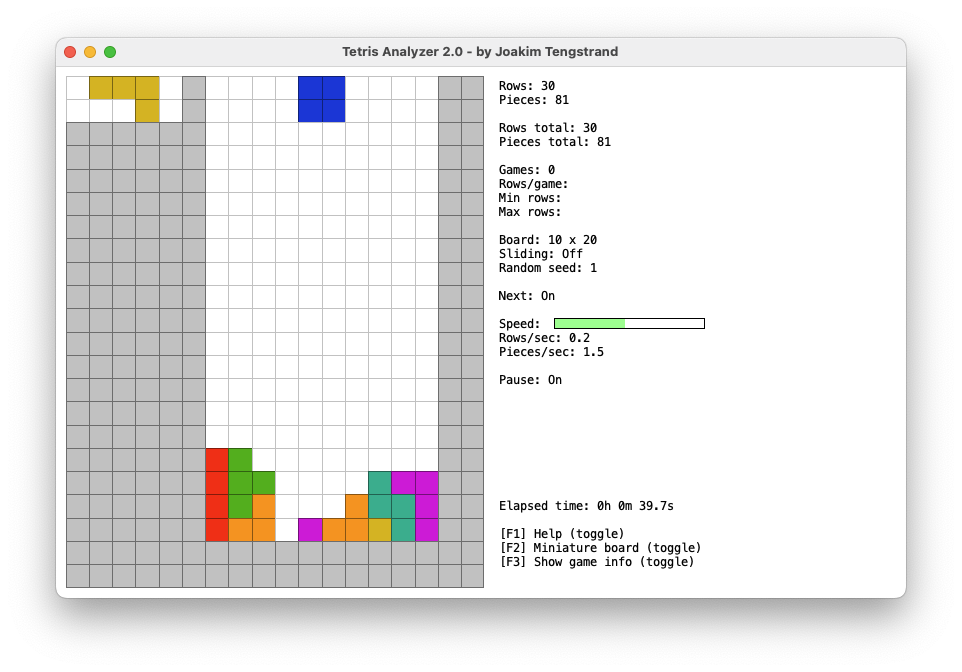
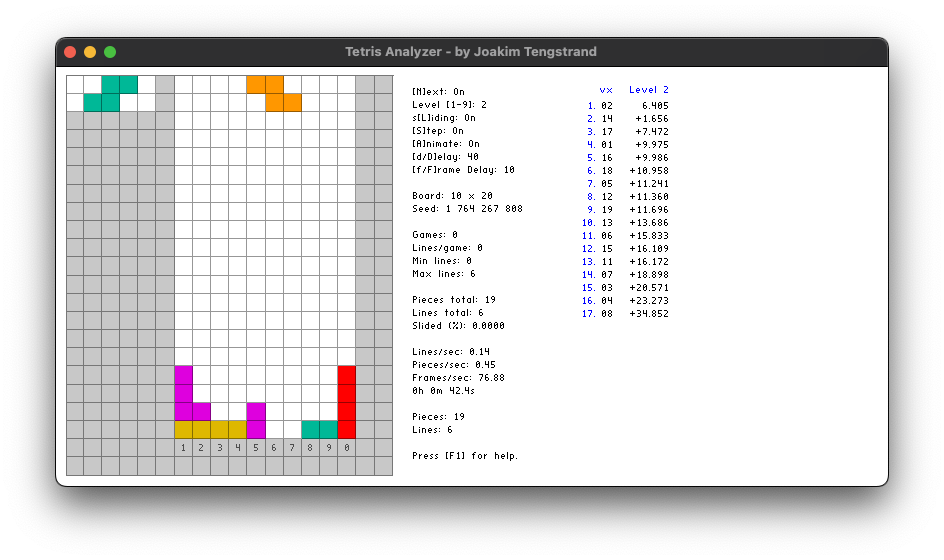
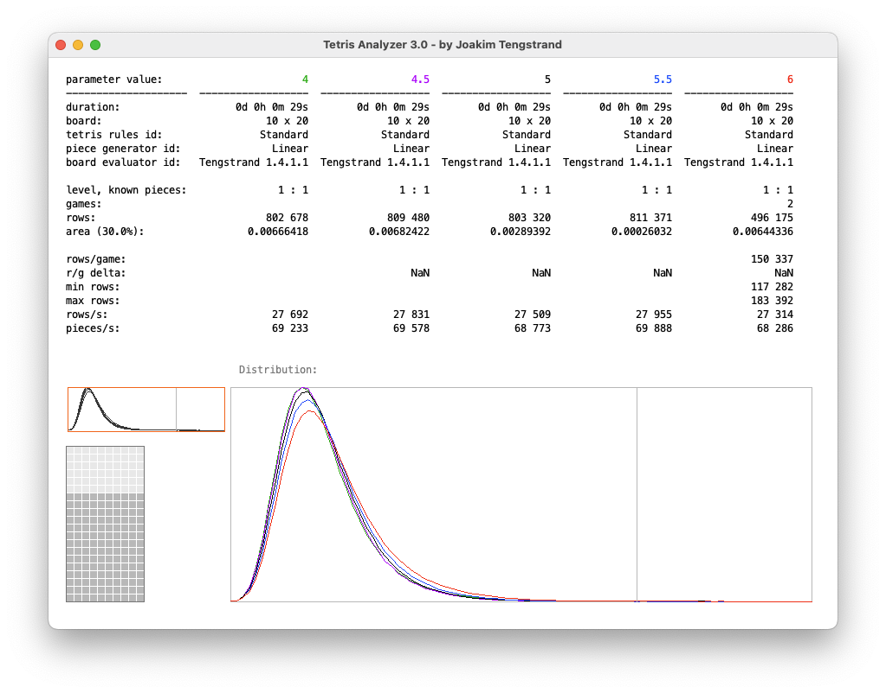

# Tetris Analyzer

A Tetris playing AI, by Joakim Tengstrand.

## The Scala version



Watch the computer play!
This highly optimized Tetris playing program can place 76,000 pieces per second on a MacBook Air M4! (set next piece to `off`, and turn on `max speed`).

It clears an average of 3,500,000 rows per game (with sliding turned off) when it doesn't know the next piece on a standard 10x20 board. If it knows the next piece, it has cleared 100,000,000 rows without ever filling more than 50% of the board.

To run the program, clone this repo and go to `langs/scala` and execute:

```bash
./build.sh
./run.sh
```

When running the program, you can press `<F1>` for help.

## The C++ version



Watch the computer play, up to 9 moves ahead!
This version is not as performance-optimized as the Scala version, and can "only" place 26,0000 pieces per second on a MacBook Air M4.

For more instructions, see [here](langs/cpp/README.md)

## Optimize the algorithm



This tool, written in Java, helps you find better parameter values used by the board evaluator, which decides how well it plays (more rows in average per game is better).

To run the program, clone this repo and go to `langs/java` and execute:

```bash
./build.sh
./run.sh example/system.yaml example/five-games-parameter-areaWidthFactor1.yaml
```

This tool is specifically written for the Scala version of the Tetris playing program, but can also be used by versions written in other languages.

For more instructions, see [here](langs/java/README.md)


Copyright (c) Joakim Tengstrand. All rights reserved.

The use and distribution terms for this software are covered by the
Eclipse Public License 1.0 (http://opensource.org/licenses/eclipse-1.0.php)
which can be found in the file epl-v10.html at the root of this distribution.
By using this software in any fashion, you are agreeing to be bound by the terms of this license.
You must not remove this notice, or any other, from this software.
