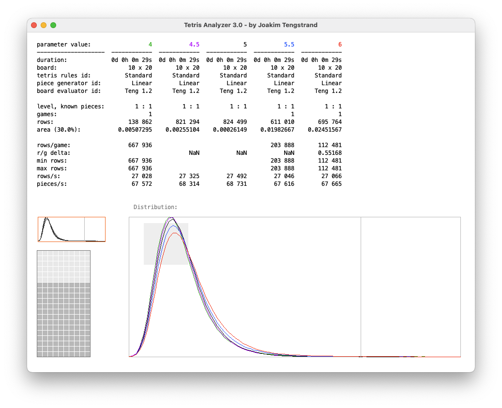
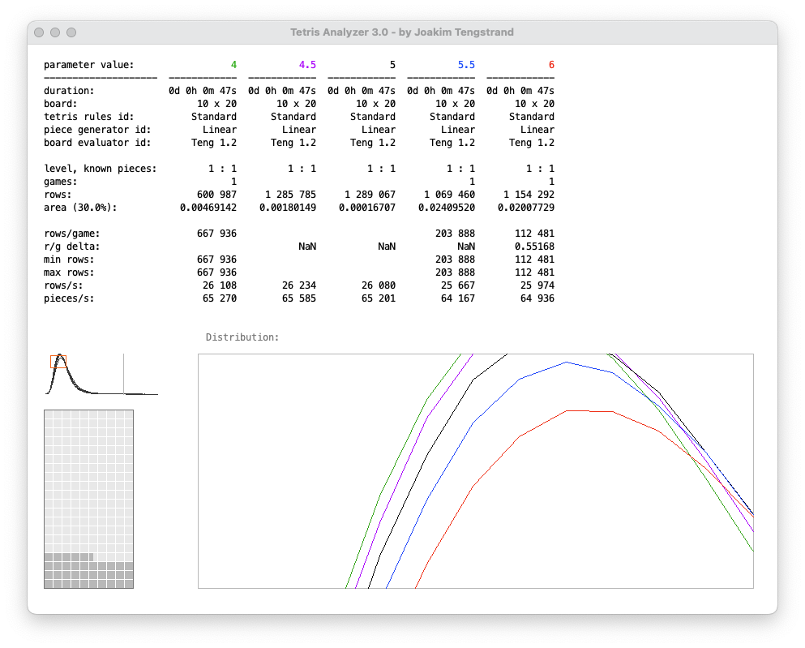

# Tetris Analyzer Java

A Java-based Tetris program, by Joakim Tengstrand.
The tool is used to optimize Tetris algorithms.


## Requirements

- Java JDK (Java 8 or later)

## Building

To build the project, run:

```bash
./build.sh
```

This will compile all Java source files into the `build/classes` directory.

## Running

The program requires two YAML configuration files as arguments:
1. **System settings file** (`system.yaml`) - Contains tetris rules, piece generators, and board evaluators
2. **Race settings file** (e.g. `example/five-games-parameter-areaWidthFactor1.yaml`) - Contains game configuration and parameters

### Quick Start

Using the provided system and race example files:

```bash
./run.sh example/system.yaml example/five-games-parameter-areaWidthFactor1.yaml
```

Or manually:

```bash
java -cp "build/classes:lib/yamlbeans-1.08.jar" \
     com.github.tetrisanalyzer.gui.TetrisAnalyzer \
     example/system.yaml \
     example/five-games-parameter-areaWidthFactor1.yaml
```

### Custom Configuration

Replace the YAML file paths with your own configuration files:

```bash
./run.sh path/to/your/system.yaml path/to/your/race.yaml
```

### How to use

**Filled cells:**
The vertical bar shows how many filled cells correspond to the selected x-position on the graph.
Use the arrow keys (left/right) to move the vertical bar. The Tetris board is updated accordingly.

The further to the left a graph is positioned (i.e., a larger proportion of positions with fewer filled cells), the lower the board height, indicating better and safer AI play. 
The AI also needs to maintain low board heights across different game states, which will shift the graph further to the left.

**Zooming:**
Zooming makes it easier to compare different parameter settings. 
- Comparing the top of the graph can be useful to see which graph is furthest to the left, indicating how well it performs on low boards.
- Comparing the slope to the bottom right can be useful to see which graph reaches the lowest point, indicating how well it performs on high boards.
- Select the area you want to zoom in on, with the mouse.
- Click right + left mouse button (at the same time) to zoom out.

<table style="border: none; border-collapse: collapse;">
<tr>
<td width="50%" style="border: none; padding: 5px;"></td>
<td width="50%" style="border: none; padding: 5px;"></td>
</tr>
</table>

**Bookmarks (Zoom shortcuts):**
- **Save bookmark:** Press `Ctrl+[1-9]` to save the current zoom position
- **Jump to bookmark:** Press `[1-9]` to jump to a saved bookmark, and press it again to go back
- **Overview:** Press `0` to zoom out to overview

**Saving and Resuming:**
- **Save manually:** Press `S` to save the current game state to the race YAML file
- **Save on close:** If the `save on close` parameter is set to `true` in the race YAML file, the state will automatically be saved on close (this is set to `false` in the example file).
- **Resume:** When you restart the program with the same race YAML file, it will resume from the saved position, continuing with the same number of games, pieces, rows, board state, and piece generator state.
